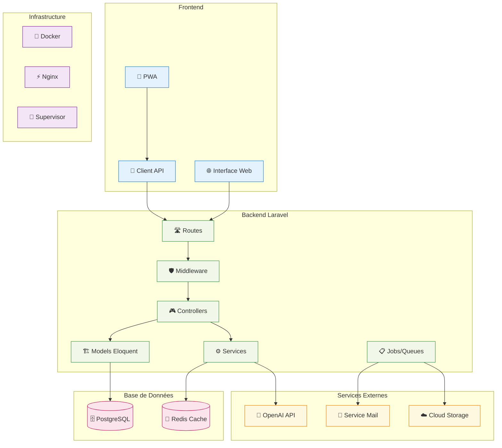
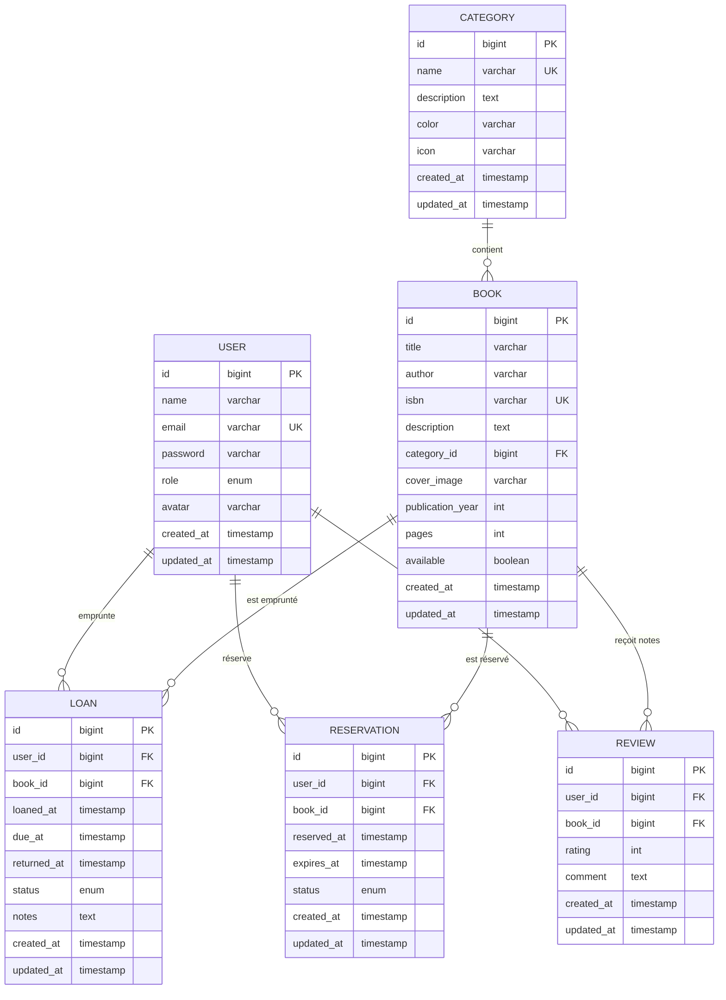

# 📚 BiblioTech - Application Laravel Éducative

[](https://laravel.com)
[](https://php.net)
[](https://docker.com)
[](https://github.com/features/codespaces)
[](https://www.onisep.fr/Ressources/Univers-Formation/Formations/Post-bac/bts-services-informatiques-aux-organisations-option-b-solutions-logicielles-et-applications-metiers)

> **Application de gestion de bibliothèque** développée avec Laravel 11 dans le cadre de la formation **BTS SIO SLAM**. Parfaite pour apprendre les concepts fondamentaux du développement web moderne avec un environnement containerisé Docker et GitHub Codespaces.

---

## 🎯 **Contexte du Projet**

### **🏫 Cadre Pédagogique**
BiblioTech est un **projet éducatif complet** conçu spécifiquement pour les étudiants de **BTS SIO option SLAM** (Solutions Logicielles et Applications Métiers). L'objectif est de maîtriser le développement web moderne à travers un cas d'usage concret et motivant.

### **🎓 Public Cible**
- **Étudiants BTS SIO SLAM** - 1ère et 2ème année
- **Formateurs** en développement web
- **Développeurs débutants** souhaitant apprendre Laravel
- **Professionnels** en reconversion

### **🎪 Objectifs d'Apprentissage**
1. **Maîtriser l'architecture MVC** avec Laravel
2. **Comprendre les bases de données** relationnelles
3. **Développer des interfaces** utilisateur modernes
4. **Intégrer des technologies** avancées (IA, WebSockets, etc.)
5. **Adopter les pratiques DevOps** (Docker, CI/CD, Tests)

### **🌟 Pourquoi une Bibliothèque ?**
Le domaine de la gestion de bibliothèque offre un contexte idéal pour l'apprentissage car il combine :
- **Entités simples à comprendre** : Livres, Utilisateurs, Emprunts
- **Relations claires** : Un utilisateur emprunte des livres
- **Fonctionnalités variées** : CRUD, recherche, authentification, notifications
- **Évolutions naturelles** : De la gestion simple aux fonctionnalités avancées

---

## 📊 **Analyse des Cas d'Utilisation**


### **👥 Diagramme des Cas d'Utilisation (Markdown & Emojis)**

Voici une représentation compatible GitHub, inspirée UML, avec les acteurs et leurs cas d'utilisation :

- 👤 **Visiteur**
    - Consulter le catalogue
    - Rechercher des livres
    - Voir détails d'un livre
    - S'inscrire

- 🔓 **Utilisateur**
    - Se connecter
    - Gérer son profil
    - Réserver des livres
    - Consulter ses emprunts
    - Noter/Commenter
    - Recevoir recommandations IA

- 👨‍💼 **Bibliothécaire**
    - Gérer les emprunts
    - Ajouter/Modifier livres
    - Gérer les utilisateurs
    - Traiter les réservations
    - Générer des rapports

- 👑 **Administrateur**
    - Configurer le système
    - Gérer les rôles
    - Sauvegarder/Restaurer
    - Monitorer performance

### **📋 Détail des Cas d'Utilisation par Séance**

#### **Séance 1-2 : Fondations (Visiteur)**
| Cas d'Usage | Description | Complexité |
|-------------|-------------|------------|
| **Consulter catalogue** | Afficher la liste paginée des livres disponibles | 🟢 Simple |
| **Rechercher livres** | Filtrer par titre, auteur, catégorie | 🟢 Simple |
| **Voir détails** | Page détaillée d'un livre avec toutes les informations | 🟢 Simple |

#### **Séances 3-4 : CRUD + Auth (Utilisateur)**
| Cas d'Usage | Description | Complexité |
|-------------|-------------|------------|
| **S'inscrire/Connecter** | Gestion complète de l'authentification | 🟡 Moyen |
| **Gérer profil** | Modification des données personnelles | 🟡 Moyen |
| **Réserver livres** | Système de réservation avec gestion des conflits | 🟡 Moyen |

#### **Séances 5-6 : Relations + Fonctionnalités (Bibliothécaire)**
| Cas d'Usage | Description | Complexité |
|-------------|-------------|------------|
| **Gérer emprunts** | Prêts, retours, relances automatiques | 🔴 Complexe |
| **CRUD livres** | Interface d'administration complète | 🟡 Moyen |
| **Rapports** | Statistiques et exports de données | 🔴 Complexe |

#### **Séances 7-8 : Technologies Avancées (Admin)**
| Cas d'Usage | Description | Complexité |
|-------------|-------------|------------|
| **Recommandations IA** | Suggestions personnalisées via OpenAI | 🔴 Complexe |
| **Monitoring** | Tableaux de bord temps réel | 🔴 Complexe |
| **QR Codes** | Génération pour inventaire physique | 🟡 Moyen |

---

## 🏗️ **Architecture du Système**

### **📐 Vue d'Architecture Générale**



### **🗄️ Modèle de Données**



---

## 🎯 **Objectifs Pédagogiques**

### **Formation BTS SIO SLAM - 8 Séances Progressives**

| 🎓 Séance | 📚 Concepts Clés | 🛠️ Technologies | 🎯 Cas d'Utilisation |
|-----------|------------------|------------------|----------------------|
| **S1** | MVC, Routes, Blade | Laravel, Docker, GitHub Codespaces | Consultation catalogue, Recherche |
| **S2** | Base de données, Migrations | PostgreSQL, Eloquent ORM | Gestion des données, Seeders |
| **S3** | CRUD, Formulaires | Validation, Sessions, Flash Messages | Inscription, Profil utilisateur |
| **S4** | Authentification, Sécurité | Laravel Auth, Middleware | Connexion, Rôles, Permissions |
| **S5** | Relations, APIs | Relations Eloquent, API REST | Emprunts, Réservations, Relations |
| **S6** | Recherche, Performance | Cache, Queues, Optimisation | Recherche avancée, Performance |
| **S7** | Technologies Avancées | QR Codes, WebSockets, IA | Recommandations, Temps réel |
| **S8** | Déploiement, Production | CI/CD, Monitoring, Scalabilité | Monitoring, Métriques, Déploiement |

---

## 🚀 **Démarrage Rapide**

### **Option 1 : GitHub Codespaces (Recommandé) 🌟**

```bash
# 1. Cliquez sur "Code" > "Create codespace on main"
# 2. Attendez la configuration automatique (2-3 minutes)
# 3. L'application se lance automatiquement sur http://localhost:8000
```

**🎉 C'est tout ! Votre environnement est prêt en 3 clics.**

### **Option 2 : Installation Locale**

```bash
git clone https://github.com/votre-organisation/bibliotech.git
cd bibliotech

# Copier le fichier d'environnement
cp .env.example .env

# Démarrer avec Docker
docker-compose up -d

# Configuration Laravel
docker-compose exec app composer install
docker-compose exec app php artisan key:generate
docker-compose exec app php artisan migrate:fresh --seed
```

---

## 🌐 **URLs de l'Application**

Une fois l'environnement démarré :

| Service | URL | Description |
|---------|-----|-------------|
| **Application** | http://localhost:8000 | BiblioTech principal |
| **MailHog** | http://localhost:8025 | Interface emails de test |
| **Adminer** | http://localhost:8080 | Administration base de données |

---

## 📁 **Structure du Projet**

```
📁 bibliotech/
├── 📁 app/                   # Code application Laravel
│   ├── Http/Controllers/     # Contrôleurs MVC
│   ├── Models/               # Modèles Eloquent
│   └── Services/             # Services métier
├── 📁 database/              # Migrations, Seeders, Factories
├── 📁 resources/             # Vues Blade, Assets, Traductions
├── 📁 routes/                # Définition des routes
├── 📁 tests/                 # Tests automatisés
├── 📁 docs/                  # Documentation pédagogique
│   ├── seance-01/           # Documentation Séance 1
│   ├── seance-02/           # Documentation Séance 2
│   └── ...                  # Autres séances
├── 🐳 docker-compose.yml    # Configuration Docker
├── 📄 .devcontainer.json    # Configuration Codespace
└── 📄 README.md             # Ce fichier
```

---

## 🎮 **Fonctionnalités Disponibles**

### **📚 Séance 1 : Fondations**
✅ **Page d'accueil** avec statistiques temps réel  
✅ **Catalogue des livres** avec 5 livres de démonstration  
✅ **Recherche simple** par titre, auteur  
✅ **Pages de détail** complètes pour chaque livre  
✅ **Interface responsive** Bootstrap 5  

### **📊 Séance 2 : Base de Données**
🔄 **Migration vers PostgreSQL** (données dynamiques)  
🔄 **Gestion CRUD complète** des livres  
🔄 **Système de catégories** hiérarchiques  

### **🔐 Séance 3-4 : Authentification**
🔄 **Inscription/Connexion** utilisateurs  
🔄 **Gestion des profils**  
🔄 **Système de rôles** (Visiteur, Utilisateur, Bibliothécaire, Admin)  

### **🔗 Séance 5-6 : Fonctionnalités Avancées**
🔄 **Système d'emprunts** complet  
🔄 **Réservations** de livres  
🔄 **Notifications** temps réel  

### **🚀 Séance 7-8 : Technologies Innovantes**
🔄 **Recommandations IA** via OpenAI  
🔄 **QR Codes** pour inventaire  
🔄 **Analytics et monitoring**  

---

## 🧠 **Guide de Formation**

### **🎓 Pour les Étudiants**

1. **Commencer par la Séance 1** : [docs/seance-01/00-README.md](docs/seance-01/00-README.md)
2. **Comprendre les concepts** : [docs/seance-01/01-CONCEPTS-MVC.md](docs/seance-01/01-CONCEPTS-MVC.md)
3. **Maîtriser le vocabulaire** : [docs/seance-01/02-GLOSSAIRE-LARAVEL.md](docs/seance-01/02-GLOSSAIRE-LARAVEL.md)
4. **Pratiquer avec les TP** : [docs/seance-01/03-TP-DECOUVERTE-APP.md](docs/seance-01/03-TP-DECOUVERTE-APP.md)
5. **S'évaluer** : [docs/seance-01/06-EVALUATION-COMPETENCES.md](docs/seance-01/06-EVALUATION-COMPETENCES.md)

### **👨‍🏫 Pour les Formateurs**

- 📋 **Progression complète** : [docs/PROGRESSION.md](docs/PROGRESSION.md)
- 🎯 **Correspondance BTS** : [docs/REFERENTIEL-BTS.md](docs/REFERENTIEL-BTS.md)
- 📊 **Grilles d'évaluation** intégrées
- 🔧 **Outils de suivi** et statistiques

---

## 🛠️ **Commandes Utiles**

### **Laravel Artisan**
```bash
# Lister toutes les routes
php artisan route:list

# Console interactive
php artisan tinker

# Nettoyer les caches
php artisan cache:clear
php artisan config:clear
php artisan view:clear

# Créer des éléments
php artisan make:controller BookController --resource
php artisan make:model Book -m
php artisan make:seeder BookSeeder
```

### **Docker & Services**
```bash
# Démarrer tous les services
docker-compose up -d

# Voir les logs en temps réel
docker-compose logs -f

# Accéder au conteneur de l'application
docker-compose exec app bash

# Arrêter tous les services
docker-compose down
```

---

## 🆘 **Support**

### **🎯 Templates d'Issues**
- 🐛 **Bug ou erreur** : [Créer une issue](../../issues/new?template=bug-report.md)
- ❓ **Question cours** : [Poser une question](../../issues/new?template=question-seance.md)
- 💡 **Suggestion** : [Proposer une amélioration](../../issues/new?template=feature-request.md)

### **📚 Documentation**
- 🔧 **Problème technique** : [Guide dépannage](docs/TROUBLESHOOTING.md)
- 📖 **Concepts Laravel** : [Concepts MVC](docs/seance-01/01-CONCEPTS-MVC.md)
- 📝 **Glossaire** : [Vocabulaire technique](docs/seance-01/02-GLOSSAIRE-LARAVEL.md)

---

## 🏆 **Pourquoi Cette Formation ?**

### **✅ Moderne**
- Laravel 11.x (dernière version)
- GitHub Codespace (développement cloud)
- Interface responsive mobile-first
- Technologies actuelles (Docker, CI/CD, IA)

### **✅ Progressive**
- 8 séances structurées et cohérentes
- Complexité croissante maîtrisée
- Projet réel qui évolue naturellement

### **✅ Pratique**
- Application complète BiblioTech
- Exercices concrets sur vrais cas d'usage
- Auto-évaluation continue avec badges

### **✅ Professionnelle**
- Bonnes pratiques Laravel respectées
- Code documenté et testé
- Architecture scalable et maintenable
- Workflow DevOps intégré

---

## 🌟 **Contribuer au Projet**

### **🔄 Pour les Étudiants**
1. **Fork** le projet
2. **Créer une branche** : `git checkout -b feature/ma-fonctionnalite`
3. **Commit** : `git commit -m 'Ajout fonctionnalité X'`
4. **Push** : `git push origin feature/ma-fonctionnalite`
5. **Pull Request** avec description détaillée

### **📝 Pour les Formateurs**
- Proposer des améliorations pédagogiques
- Ajouter des exercices ou évaluations
- Corriger la documentation
- Partager des cas d'usage intéressants

---

## 📜 **Licence**

Projet éducatif libre sous licence CC BY-SA 4.0 — voir le fichier [LICENSE](LICENSE) pour plus de détails.

---

🎯 **Prêt à devenir un expert Laravel ? Lancez votre Codespace et commençons !**

⭐ **N'oubliez pas l'étoile si cette formation vous aide !**