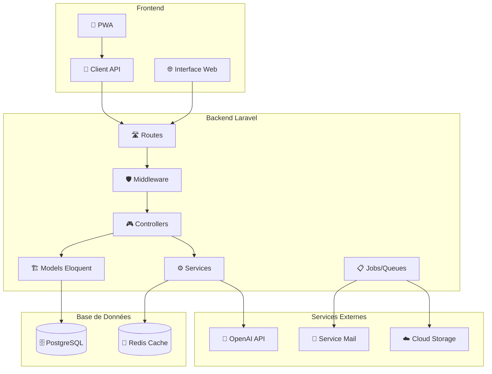
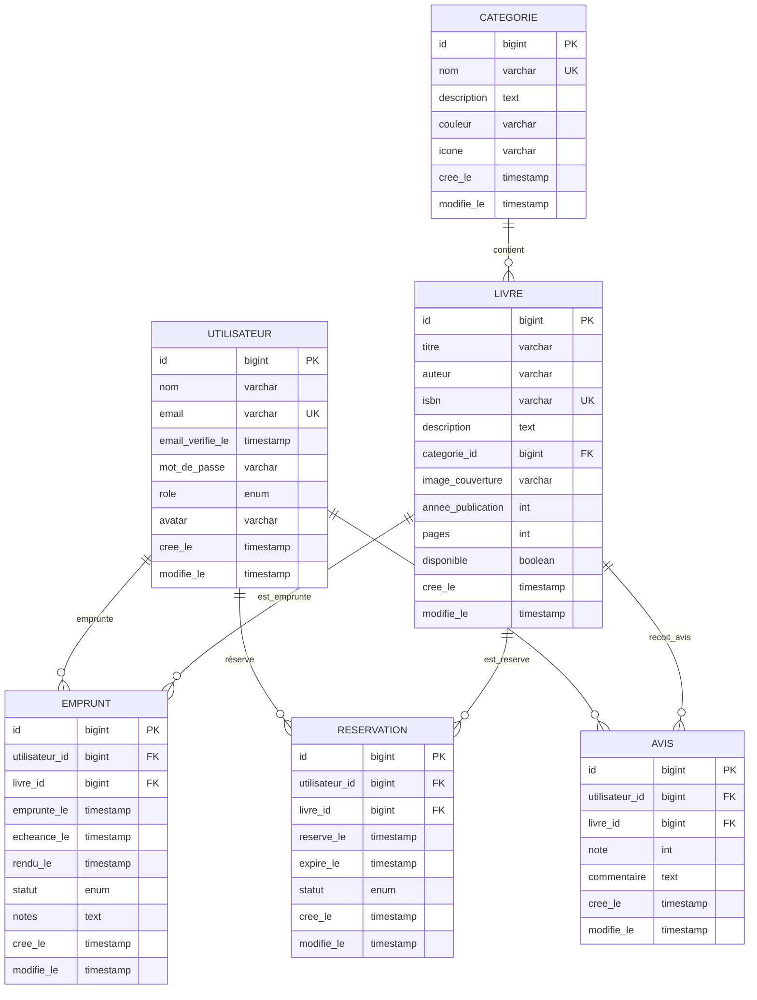

# 📚 BiblioTech - Formation Laravel BTS SIO SLAM


## 🎯 **À propos du Projet**

**BiblioTech** est une application de gestion de bibliothèque moderne développée avec Laravel, conçue spécialement pour la formation BTS SIO SLAM. Le projet couvre progressivement tous les aspects du développement web moderne : de l'architecture MVC aux technologies avancées (IA, WebSockets, QR Codes).

### **🎓 Public Cible**
- **Étudiants BTS SIO SLAM** - 1ère et 2ème année
- **Formateurs** en développement web
- **Développeurs débutants** souhaitant apprendre Laravel
- **Professionnels** en reconversion

### **🎪 Objectifs d'Apprentissage**
1. **Maîtriser l'architecture MVC** avec Laravel
2. **Comprendre les bases de données** relationnelles
3. **Développer des interfaces** utilisateur modernes
4. **Intégrer des technologies** avancées (IA, WebSockets, etc.)
5. **Adopter les pratiques DevOps** (Docker, CI/CD, Tests)

### **🌟 Pourquoi une Bibliothèque ?**
Le domaine de la gestion de bibliothèque offre un contexte idéal pour l'apprentissage car il combine :
- **Entités simples à comprendre** : Livres, Utilisateurs, Emprunts
- **Relations claires** : Un utilisateur emprunte des livres
- **Fonctionnalités variées** : CRUD, recherche, authentification, notifications
- **Évolutions naturelles** : De la gestion simple aux fonctionnalités avancées

---

## 📊 **Analyse des Cas d'Utilisation**

### **👥 Acteurs et Rôles**

#### **🌐 Visiteur (Non connecté)**
- Consulter le catalogue public
- Rechercher des livres
- Voir les détails d'un livre
- S'inscrire au système

#### **🔓 Utilisateur Connecté**
- Emprunter des livres
- Gérer ses emprunts
- Réserver des livres
- Laisser des avis et notes
- Recevoir des recommandations

#### **👨‍💼 Bibliothécaire**
- Gérer le catalogue (CRUD livres)
- Gérer les utilisateurs
- Traiter les emprunts/retours
- Générer des rapports

#### **🛡️ Administrateur**
- Gérer les bibliothécaires
- Configurer le système
- Accéder aux analyses avancées
- Maintenir l'application

---

## 🏗️ **Architecture du Système**

### **📐 Vue d'Architecture Générale**



### **🗄️ Schéma de Base de Données**



### **📈 Relations des Données**

| **Relation** | **Type** | **Description** |
|--------------|----------|------------------|
| Utilisateur → Emprunt | One-to-Many | Un utilisateur peut avoir plusieurs emprunts |
| Livre → Emprunt | One-to-Many | Un livre peut être emprunté plusieurs fois |
| Utilisateur → Reservation | One-to-Many | Un utilisateur peut réserver plusieurs livres |
| Livre → Reservation | One-to-Many | Un livre peut être réservé plusieurs fois |
| Utilisateur → Avis | One-to-Many | Un utilisateur peut laisser plusieurs avis |
| Livre → Avis | One-to-Many | Un livre peut recevoir plusieurs avis |
| Categorie → Livre | One-to-Many | Une catégorie contient plusieurs livres |

---

## 🎯 **Objectifs Pédagogiques**

### **Formation BTS SIO SLAM - 8 Séances Progressives**

| 🎓 Séance | 📚 Concepts Clés | 🛠️ Technologies | 🎯 Cas d'Utilisation |
|-----------|------------------|------------------|----------------------|
| **S1** | MVC, Routes, Blade | Laravel, Docker, GitHub Codespaces | Consultation catalogue, Recherche |
| **S2** | Base de données, Migrations | PostgreSQL, Eloquent ORM | Gestion des données, Seeders |
| **S3** | CRUD, Formulaires | Validation, Sessions, Flash Messages | Inscription, Profil utilisateur |
| **S4** | Authentification, Sécurité | Laravel Auth, Middleware | Connexion, Rôles, Permissions |
| **S5** | Relations, APIs | Relations Eloquent, API REST | Emprunts, Réservations, Relations |
| **S6** | Recherche, Performance | Cache, Queues, Optimisation | Recherche avancée, Performance |
| **S7** | Technologies Avancées | QR Codes, WebSockets, IA | Recommandations, Temps réel |
| **S8** | Déploiement, Production | CI/CD, Monitoring, Scalabilité | Monitoring, Métriques, Déploiement |

---

## 🚀 **Démarrage Rapide**

### **Option 1 : GitHub Codespaces (Recommandé) 🌟**

1. **Cliquez sur le bouton vert "Code"**
2. **Sélectionnez l'onglet "Codespaces"** 
3. **Cliquez "Create codespace on main"**
4. **Attendez 2-3 minutes** - L'application se configure automatiquement
5. **Accédez à http://localhost:8000** quand le terminal affiche "✅ BiblioTech est prêt !"

**🎉 C'est tout ! Votre environnement est prêt en 3 clics.**

### **Option 2 : Installation Locale**

```bash
# Cloner le projet
git clone https://github.com/votre-username/bibliotech.git
cd bibliotech

# Docker Compose
docker-compose up -d

# Installation des dépendances
docker-compose exec app composer install
docker-compose exec app npm install && npm run build

# Configuration
docker-compose exec app cp .env.example .env
docker-compose exec app php artisan key:generate

# Base de données
docker-compose exec app php artisan migrate --seed

# Accéder à l'application
# http://localhost:8000
```

---

## 📚 **Structure du Projet**

```
bibliotech/
├── 📂 app/
│   ├── 📂 Http/Controllers/     # Contrôleurs Laravel
│   ├── 📂 Models/              # Modèles Eloquent
│   └── 📂 Services/            # Services métier
├── 📂 database/
│   ├── 📂 migrations/          # Migrations de base de données
│   ├── 📂 seeders/            # Données de test
│   └── 📂 factories/          # Factories pour les tests
├── 📂 resources/
│   ├── 📂 views/              # Templates Blade
│   ├── 📂 css/               # Styles CSS
│   └── 📂 js/                # JavaScript
├── 📂 routes/
│   ├── web.php               # Routes web
│   └── api.php               # Routes API
├── 📂 docs/
│   ├── 📂 SEANCE-1/          # Documentation Séance 1
│   ├── 📂 SEANCE-2/          # Documentation Séance 2
│   └── ...                   # Autres séances
├── 📂 .devcontainer/         # Configuration Codespace
├── 📂 docker/                # Configuration Docker
├── docker-compose.yml        # Services Docker
└── README.md                 # Ce fichier
```

---

## 🛠️ **Technologies Utilisées**

### **🎯 Stack Principal**
- **Framework** : Laravel 11.x
- **Langage** : PHP 8.2+
- **Base de données** : PostgreSQL 15
- **Cache** : Redis
- **Frontend** : Blade Templates + Bootstrap 5
- **Containerisation** : Docker + Docker Compose

### **📦 Dépendances Clés**
- **laravel/framework** : Framework principal
- **laravel/sanctum** : Authentification API
- **spatie/laravel-permission** : Gestion des rôles
- **barryvdh/laravel-debugbar** : Debug en développement
- **intervention/image** : Manipulation d'images

### **🔧 Outils de Développement**
- **GitHub Codespaces** : Environnement de développement cloud
- **Laravel Sail** : Environnement Docker pour Laravel  
- **Laravel Mix** : Compilation des assets
- **PHPUnit** : Tests unitaires et fonctionnels

---

## 📖 **Documentation par Séance**

| Séance | Documentation | Exercices | Code Source |
|---------|---------------|-----------|-------------|
| **Séance 1** | [📖 Guide S1](docs/seance-01/00-README.md) | [💪 Exercices S1](docs/seance-01/05-EXERCICES-PRATIQUES.md) | [📁 Code S1](docs/seance-01/) |

---

## 🤝 **Contribution et Support**

### **💡 Comment Contribuer**
1. **Fork** le projet
2. **Créer une branche** pour votre feature (`git checkout -b feature/AmazingFeature`)
3. **Commiter** vos changements (`git commit -m 'Add some AmazingFeature'`)
4. **Push** vers la branche (`git push origin feature/AmazingFeature`)
5. **Ouvrir une Pull Request**

### **🆘 Support**
- **Issues GitHub** : Pour les bugs et demandes de fonctionnalités
- **Discussions** : Pour les questions générales et l'aide
- **Wiki** : Documentation détaillée et FAQ

---

## 📄 **Licence**

Ce projet est sous licence Creative Commons BY-SA 3.0. Voir le fichier [LICENSE](LICENSE) pour plus de détails.

---

**🎯 Prêt à apprendre Laravel ? Créez votre Codespace maintenant !**

[](https://codespaces.new/votre-username/bibliotech)